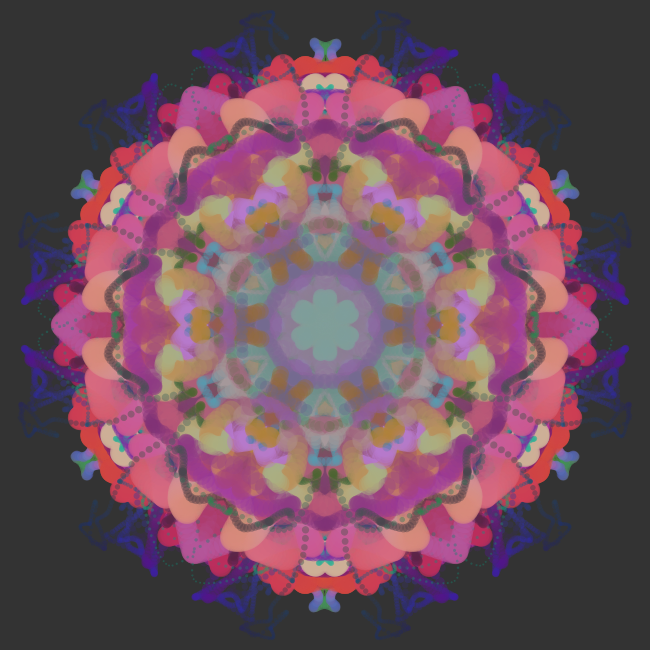

# Keleidoscope Simulation with Perlin Noise

This is a project based on [a Coding Train video](https://youtu.be/R3C2giDfmO8) by [Dan Shiffman](https://www.youtube.com/channel/UCvjgXvBlbQiydffZU7m1_aw). This programme is written using [Processing](processing.org).

### Added Features

A new particle is added when you press a key. You can also draw with the mouse.

### Preview

Click [here](https://youtu.be/BD4Y-88ryvE) for a preview of the programme.

### Processing

This programme is made using [Processing](http://processing.org/). You'll need to install Processing to run this programme.

### Instructions:

-   Install Processing.
-   Clone this repo in your computer using this command:
    `git clone https://github.com/Ivan-Denisovich-py/kaleidoscope-simulation.git`
-   Run Kaleidoscope.pde
